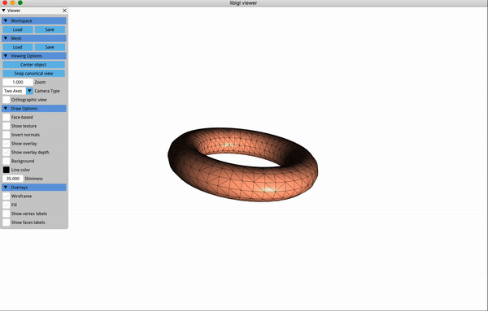

## Introduction

For this assignment, we leave the realm of deformable objects altogether, instead focusing on objects that do not deform at all. Such rigid body models gain some simplicity via the avoidance of potential energy functions but this is somewhat offset by more complicated generalized coordinates.  

Specifically, we will implement an unconstrained rigid body (an exciting torus!) that you can click and pull around. 

### Prerequisite installation

On all platforms, we will assume you have installed cmake and a modern c++
compiler on Mac OS X[¹](#¹macusers), Linux[²](#²linuxusers), or
Windows[³](#³windowsusers).

We also assume that you have cloned this repository using the `--recursive`
flag (if not then issue `git submodule update --init --recursive`). 

**Note:** We only officially support these assignments on Ubuntu Linux 18.04 (the OS the teaching labs are running) and OSX 10.13 (the OS I use on my personal laptop). While they *should* work on other operating systems, we make no guarantees. 

**All grading of assignments is done on Linux 18.04**

### Layout

All assignments will have a similar directory and file layout:

    README.md
    CMakeLists.txt
    main.cpp
    assignment_setup.h
    include/
      function1.h
      function2.h
      ...
    src/
      function1.cpp
      function2.cpp
      ...
    data/
      ...
    ...

The `README.md` file will describe the background, contents and tasks of the
assignment.

The `CMakeLists.txt` file setups up the cmake build routine for this
assignment.

The `main.cpp` file will include the headers in the `include/` directory and
link to the functions compiled in the `src/` directory. This file contains the
`main` function that is executed when the program is run from the command line.

The `include/` directory contains one file for each function that you will
implement as part of the assignment.

The `src/` directory contains _empty implementations_ of the functions
specified in the `include/` directory. This is where you will implement the
parts of the assignment.

The `data/` directory contains _sample_ input data for your program. Keep in
mind you should create your own test data to verify your program as you write
it. It is not necessarily sufficient that your program _only_ works on the given
sample data.

## Compilation for Debugging

This and all following assignments will follow a typical cmake/make build
routine. Starting in this directory, issue:

    mkdir build
    cd build
    cmake ..

If you are using Mac or Linux, then issue:

    make

## Compilation for Testing

Compiling the code in the above manner will yield working, but very slow executables. To run the code at full speed, you should compile it in release mode. Starting in the **build directory**, do the following:

    cmake .. -DCMAKE_BUILD_TYPE=Release
    
Followed by:

    make 
  
Your code should now run significantly (sometimes as much as ten times) faster. 

If you are using Windows, then running `cmake ..` should have created a Visual Studio solution file
called `a5-rigid-bodies.sln` that you can open and build from there. Building the project will generate an .exe file.

Why don't you try this right now?

## Execution

Once built, you can execute the assignment from inside the `build/` using 

    ./a5-rigid-bodies

While running, you can reset the position of the rigid body by pressing `r`. 

## Background 

In this assignment we will implement a physics simulation of an unconstrained rigid body in low gravity (e.g. space [donut](https://www.youtube.com/watch?v=8-4P1WPE-Qg) which you can interactively fling around the world. The goal is to get a good handle on the kinematics and dynamics of rigid body mechanics, which we will extend in the final assignment to handle collision resolution. Rigid bodies are the first type of object we will encounter that use a truly generalized, generalized coordinate (i.e not just the vertex positions of the mesh) and this complicates both their mathematical treatment and implementation. Let's dive right in!

## Resources

Like cloth simulation, comprehensive, readable resources about rigid body dynamics and simulation are hard to find. Some people reccomend this [book](https://www.cds.caltech.edu/~murray/books/MLS/pdf/mls94-complete.pdf), which is quite mathematical. This [paper](https://animation.rwth-aachen.de/media/papers/2012-EG-STAR_Rigid_Body_Dynamics.pdf) provides a detailed overview of rigid body simulation with contact, but is also very equation heavy. In these notes I'll try to provide a one-stop basic introduction to rigid body dynamics, leaning heavily (as usual) on the variational approach. The rotation matrix derivative is more or less a reproduction of the wonderful paper [here](https://www.cis.upenn.edu/~cjtaylor/PUBLICATIONS/pdfs/TaylorTR94b.pdf).

## Generalized Coordinates and Velocities 

### Generalized Coordinates for Rigid Motion

As with all previous assignments, we begin our journey into rigid body simulation by searching for approriate generalized coordinates. Once we have these, all remaining kinematic and dynamic relationships can be derived by turning our variational crank. Rigid bodies are going to be the first time we see generalized coordinates that are not just vertex positions. Why is that ?

The rigid body model is an *approximation* which we use for objects that do not deform meaningful in the simulated scenario. To be clear **everything deforms** and everything is deforming all the time, its just often so small that we can't see it, nor does it effect the salient behaviour of our object of interest. In these cases it would be a big waste (of time and memory) to use something like [finite elements](https://github.com/dilevin/CSC2549-a3-finite-elements-3d) to simulate said object. So instead we choose generalized coordinates that do not allow the object to deform at all. 

Previously when we discussed deformation, we considered how the squared length of a vector in some undeformed space changes under a deformation mapping. What we learned is that, given this undeformed vector , its deformed squared length became 

where  is the deformation gradient of the deformation mapping. A good question to ask is *what is required of F so that  ? Well, we want , where  is the identity matrix (if you've taken [CSC418](https://github.com/dilevin/computer-graphics-csc418) then you've seen this argument before but wrt the transformation of normal vectors). This property, that the transpose of a matrix is also its inverse, is associated with the special class of matrices called [**orthogonal matrices**](https://en.wikipedia.org/wiki/Orthogonal_matrix). Orthogonal matrices thus represent transformations that preserve the distance between all points being transformed. In other words, they do not allow deformation (just what we were looking for). 

Additionally, we've all learned the painful lesson that we don't want our simulated objects to turn inside out. So we'd also like the determinant of  to be positive. This eliminates such transformations as reflections, leaving us with rotations as the only valid form of . Because  (here  is a rotation matrix), then

where  is a constant of integration and is a rigid body translation. This shows us that the world space position,  of any point in the undeformed space  is given by the familiar rigid body transformation. This transformation is parameterized by  and  and so we will choose these as our generalized coordinates . Now rather than  being a set of vertex position, it is a set of rotations and translations for each rigid body in our physical system. 

### Generalized Velocities for Rigid Motion

Now that we know how to find the world space position of any point,  in a rigid body, we can take the time derivative to get the generalized velocities.

Derivatives of rotation matrices are scary, at least I find them scary. That scariness comes from the inherent constraint that . Any derivative we take as to respect this. One way to do this is to exploit the fact that rotation matrices are part of a special group of matrices called the [*Special Orthogonal Group*](https://en.wikipedia.org/wiki/Orthogonal_group) and are also a [Lie Group](https://en.wikipedia.org/wiki/Lie_group). Lie Groups can be parameterized by an exponential map that takes an element from the Lie Algebra (a linear space) onto the manifold that represents the Lie Group. A convenient fact about rotation matrices is that the can be represented as 

Here  is the [matrix exponential](https://en.wikipedia.org/wiki/Matrix_exponential),  is a  vector and  is the , [skew-symmetric](https://en.wikipedia.org/wiki/Skew-symmetric_matrix) matrix created from that vector.We can exploit this formulation to take derivatives in a (slightly) less onerous fashion. As a note, this sort of derivative is often referred to as "geometrically-aware" since it will respect the geometry of the Lie Group. 

Ok, lets proceed by infinitesimally perturbing our rotation matrix. We can do this by adding an infinitesimal multiple of another skew-symmetric matrix , which gives us

where the scalar,  controls the magnitude of the perturbation. Since this perturbation is meant to be infinitesimally small,  is limited towards . 

What remains is to deal with . To do this we are going to replace the exponential operator with its infinite series. This let's us concoct the following:

Now we are going to compute . This is called a [differential](https://en.wikipedia.org/wiki/Differential_of_a_function) and it represents a directional derivative, the change in a function if you move in a particular direction. In this case our direction is . The differential is really doing two things at once. The first is computing the directional derivative around some point , while the second is using the limit to "move" the point at which the derivative is evaluated back to . **NOTE:** this limit is incredibly helpful. It means we can ignore any terms in the above equation that are functions of , since it will become zero. 

A little bit of exciting calculus, followed by some less exciting algebra should convince you that 

But wait, there's more !! We can simplify a bit further by realizing that  has survived the differential in its infinite series form (maybe not surprising given how exponentials usually  persist through derivatives). So at the end of it all we get

Which is not half bad. For the full details of these sorts of derivations, I cannot reccomend this [paper](https://www.cis.upenn.edu/~cjtaylor/PUBLICATIONS/pdfs/TaylorTR94b.pdf) enough.

Now our remaining task is to figure out how this relates to the time derivative we were **originally trying to take**. 

#### What does it all mean ? 

Let's start reinterpreting all of this through a physical lens, starting with . In our case, we aren't differentiating wrt to an arbitrary parameter, but rather by a time. This means, for us,  is really . Therefore what we really computed was . Well that's lucky, otherwise I would've just wasted a whole bunch of time. 

The final piece of the puzzle is the meaning of . Let's start by figuring out what units  is in. When we perturb the rotation matrix we compute . If  is in seconds, then  is . Which means its a velocity. Wow, that is really quite useful. Let's see if we can pin down what type of velocity it is. To do this, we need to recognize that a  skew-symmetric matrix multiplying a vector is really encoding a [cross-product](https://en.wikipedia.org/wiki/Cross_product). So 

If you remember your high-school physics (and I certainly do not), you will recall that some velocity, crossed with a position in space is an [angular velocity](https://en.wikipedia.org/wiki/Angular_velocity), the rate of rotation of a point around the origin of a space. Let's use  to represent the angular velocity vector and let's start doing that now: . 

There's one last missing piece, which is our rotation matrix . One of the hardest things to keep straight in rigid body mechanics is in what space quantities are defined in. Remember, that  is  mapping vectors between the undeformed (often called the body space) . Normally these vectors are position vectors (the vector from the origin of a space to a point in that same space). But they can also be other things, like velocities! Remember our time derivative is  -- that rotation matrix is mapping the angular velocity, , from the undeformed space to the world. This means that  is defined in the undeformed space. Now, some people will leave things at that, but I find it a bit weird, especially since in all the previous assignments our velocities are defined in the world space. So I'm going to define a world space angular velocity, , so that . After all this we arrive at 

where the final rearrangement (swapping  and ) exploits the properties of skew symmetric matrices. Now we can finally chose  and  as our generalized velocities. As is typical, we would like to rewrite this in matrix form, and so it becomes

where  is the *rigid body jacobian* (sometimes written as ). 

**Important Note:** matrix exponentials can be expensive to compute. However, for the special orthogonal group, in 3-dimensions, there's a beautiful analytical short cut called [Rodrigues' Rotation Formula](https://en.wikipedia.org/wiki/Rodrigues%27_rotation_formula) (note the "s"). You will implement this for the assignment.

## Kinetic energy

We finally reach a point where the elegance of the variational approach starts to kick in. As usual we define kinetic energy as 

By direct substitution we end up with

The bad news is that  is no longer constant, it depends on the orientation of the rigid body, but the partial good news, is that a big chunk of it,  can be precomputed. Plus, we can make our lives a bit easier by looking at some individual components of . 

First, note that the lower-right block of  is . This integral is trivially equal to  where  is the mass of the entire object. 

Second, let's consider the off-diagonal blocks, of the form  (or the transpose). Remember that each entry of   is just a component (either , , ) of . So the entries of this matrix are one of , ,  (or their negations). 

What's interesting is that the vector  is the [center-of-mass](https://en.wikipedia.org/wiki/Center_of_mass) of the object. All this time I've been using  to represent a point in the undeformed space of a rigid body -- and I **never** chose the origin of the space (how naughty of me). Well, now I'm going to make a choice, one which will make my life a lot easier going forward. I'm going to choose the origin of the undeformed space to be **the center-of-mass**. This means that by definition . Because  is greater than zero by definition, the off-diagonal blocks of  become **zero**. 

This choice of origin also gives our generalized coordinates and velocities more meaning. Our rotation and translation variables are really measuring rotation around, and translation of, the center-of-mass of our object. 

After all this we get a drastically nicer version of  which is 

This version of  has two convenient properties. First, it completely decouples the effect of angular and linear velocities on kinetic energy (this will make the equations of motion nicer). Second, we only have one tricky integral to evaluate. 

One way you could compute the remaining integrals (upper left block and mass) would be to tetrahedralize your simulation mesh and use quadrature. That's a bit unsatisfying because it adds an extra layer of [geometry processing](https://github.com/alecjacobson/geometry-processing-csc2520) to the proceedings (and who wants that ?). For this assignment we are going to do something somewhat more satisfying ... 

### Surface-Only Integration

The method we will use for integration was popularized Brian Mirtich [here](http://citeseerx.ist.psu.edu/viewdoc/download?doi=10.1.1.56.127&rep=rep1&type=pdf). It uses the [divergence theorem](https://en.wikipedia.org/wiki/Divergence_theorem) to convert volume integrals into surface integrals and thus allows there evaluation using a surface, rather than a volumetric discretization.  The basic idea is to rephrase integrals of the type 

to 

where  and  is the outward facing surface normal at , .

What makes this particularly attractive for rigid body inertia tensors is that  is very simple. For instance, for the mass calculation we have  . Let's make an easy choice for the function . Therefore our integral becomes

where  is the  component of the surface normal. Because our surfaces are divided up into triangle meshes, we can evaluate this integral one triangle at a time and add up the results which gives - 

 

Additionally, because the entries of  are all quadratic in , similar formulas can be found and applied (Mirtich kindly lists them all in his paper).

## Potential Energy

Since rigid bodies don't deform, they don't store any potential energy. Consider this the return you get for persevering through the rotation stuff :)

## The Equations of Motion

The slightly funny form of the kinetic energy leads to a different set of equations of motion for rigid body simulations. These equations are called [Euler's equations of rigid motion](https://en.wikipedia.org/wiki/Euler%27s_equations_(rigid_body_dynamics)). They are also the Euler-Lagrange equations for the Principle of Least Action, derived using our rotations and angular velocities as generalized coordinates and velocities. There is a very detailed write up of how this is done [here](http://www.math.ucsd.edu/~mleok/pdf/samplechap.pdf).

As is the usual case we can form the Lagrangian  where  for rigid bodies. Initially it would seem to make sense to use our kinetic energy  from above, which is parameterized by, , the world space angular velocity. Sadly, this will make the derivation very difficult, and here's why. Recall that 

where  is the world space angular velocity. A small variation to  can be constructed by varying  and  together. This is tricky to account for. Rather than deal with things this way, its is easier to work, for a moment, using . Now our kinetic energy becomes

where  is the upper-left block of . I've written it out like this because, for this decoupled system we can apply calculus of variations seperately for the rotational and linear parts. Thus we get two sets of equations of motion, one computed by setting  and the other computed by setting . The second equation uses standard, linear velocities and is handled as usual, leading to 

Here I've added an external forcing term and we observe that the center-of-mass of the rigid body behaves exactly like a regular particle in 3d. 

The rotational component is a little bit tricker because we need to compute . Much like our previous rotational time derivative,  must take into account the special structure of the Orthogonal Group. Suppressing all the details, this leads to an extra term in the final equations of motion, known as the *Quadratic Velocity Vector*. This gives us the equations of motion for the rotational variables as 

where  is an external torque applied to the system. This is equivalent to to 

where  becomes the world space external torque.

Now all that remains is to integrate our center-of-mass and angular acceleration equations to produce rigid body motion.

## Time Integration of Rotating Objects

Because we have no elastic forces to worry about, we can get away with simpler, explicit time integration (**at least for rigid objects that aren't spinning too quickly**). As such we will apply an explicit Euler type scheme that works in the following way. Like symplectic Euler, we will first compute new velocities for our objects, and then update their positions. For the center-of-mass (particle) equation, this is done using [symplectic Euler](https://github.com/dilevin/CSC2549-a1-mass-spring-1d), exactly!

To update our angular velocities we can proceed as normal, by which I mean replacing our accelerations with standard first order finite differences. Why is this ok for angular accelerations and velocities ? Because these terms act in relation to the tangent space of our Lie Group. The tangent space is a locally flat space (like Euclidean space) and so we can (for a brief moment) ignore all the difficulties rotations and their orthogonality constraint introduce. This means the first step of our integrator solves

This is an explicit integration step, we evaluate all the positional variables and forces at the current time step. 

The final tricky part is to update our rotation matrix. Now all the complications return. We can't just add our new angular velocity to the exiting rotation matrix. Recall from our initial discussion of rotations that the angular velocity equation is . If  is constant, this is a linear ordinary differential equation and can be solved with (you guessed it) the matrix exponential, yielding

which gives us the updated rotation matrix . 

It's this set of update equations you will use to implement rigid body dynamics in this assignment.

## Assignment Implementation

In this assignment you will implement everything needed to simulate an unconstrained rigid body in free space. This includes the mass matrix integration and the explicit, exponential Euler time integrator. While you are encouraged to consult any linked resources, **DO NOT** use any available source code in your assignment. You must code everything yourself. 

### Implementation Notes

Because the generalized coordinates are no longer just a stacked vector of points, accessing them becomes trickier. To make this a little easier we will use the [``Eigen::Map``](https://eigen.tuxfamily.org/dox/classEigen_1_1Map.html) functionality. This let's you create a proxy linear algebra operator from a raw chunk of memory. In this assignment, the rotation matrix and position vector representing a rigid bodies configuration are flattened out and stored in a single *Eigen VectorXd*. To extract the rotation matrix from the rigid body indexed by ``irb`` you should do the following

``Eigen::Matrix3d R = Eigen::Map<const Eigen::Matrix3d>(q.segment<9>(12*irb).data());``

Note that I am using the templated version of the segment method, where the segment size is inside the ``<>``. 

### rodrigues.cpp

The rodrigues formula for computing the marix exponential of a , skew-symmetric matrix.

### rigid_to_world.cpp

The rigid transformation from the undeformed space to the world (deformed) space.

### rigid_body_jacobian.cpp

The Jacobian of the rigid-to-world transform. 

### inertia_matrix.cpp

Compute the rigid inertia matrix of a 3d object, represented by a surface mesh, via surface only integration.

### pick_nearest_vertices.cpp

**Use your code from the previous assignments**

### dV_spring_particle_particle_dq.cpp

**Use your code from the previous assignments**

### exponential_euler.h

Implement the explicit, exponential Euler time integration scheme. 
